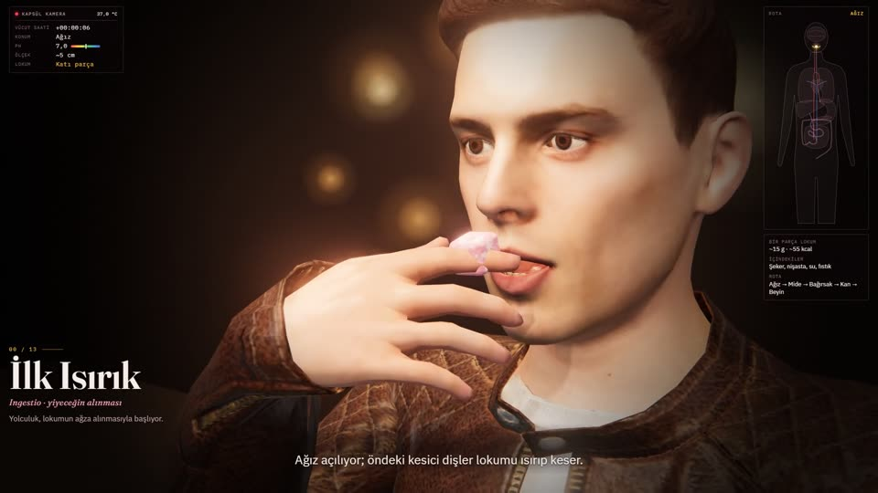

# Sindirim Yolculuğu



Bir besinin ağızdan beyne uzanan yolculuğu; yanında giden minik bir "kapsül kamera" gözünden. Kafede oturan gerçekçi bir karakter (Avaturn GLB) bir parça fıstıklı lokumu parmaklarıyla alıp ısırır; röntgen görünümünde dişler, dil ve yemek borusu görünür, kamera ağızdan içeri girer ve 13 durak boyunca sindirim, kan dolaşımı ve beyne kadar ilerler.

**İzle:** https://eyupduran.github.io/animasyon-lab/digestive-journey/

| | |
|---|---|
| Teknik | Three.js r170 · WebGL · Web Audio · Avaturn GLB karakter |
| Süre | ~5,5 dk (sayfa) · 6 dk 24 sn (anlatımlı video) |
| Dil | Türkçe alt yazı ve anlatım |

## Komutlar

Bu klasörde:

```
node build.mjs            # → dist/index.html (çift tıklayıp açılır, internet gerekir)
npm install               # yalnızca video ve karakter araçları için
npm run video             # → renders/*.mp4 (1080p60 anlatımlı, anlatımsız, 720p) · ~1 saat
npm run video:test        # her bölümden bir kare, düzeni kontrol etmek için
npm run avatar -- "C:/Users/Eyüp/Desktop/cafe-avatars-glb/set-01-m01.glb" assets/avatar.glb
```

### Anlatım ve altyazı

Sayfadaki anlatım, her alt yazı için yerelde üretilmiş bir kayıttır (OmniVoice, O1 sesi: genç kadın; `narration/voice/`). Kayıt, alt yazısı ekrana geldiğinde başlar; cümle bir sonraki alt yazıya taşacaksa sahne önceden, fark edilmeyecek kadar yavaşlar. Alt çubukta **CC** (ya da C tuşu) alt yazıyı, **Anlatım** (ya da N tuşu) sesi açıp kapatır; seçimler tarayıcıda hatırlanır.

Alt yazı metni değişince:

```
node tools/lines.mjs                                   # narration/lines.json: söylenecek satırlar (sayılar sözcükle, parantezler "yani" ile)
cd ../.. && npm run voice -- digestive-journey         # yalnızca değişen satırlar yeniden seslendirilir
npm run voice -- digestive-journey --voice omni-erkek-derin   # başka bir sesle
node build.mjs
```

Eski video aracı (`npm run video`) hâlâ Windows'un Tolga sesini kullanıyor; yeni seslerle video daha sonra güncellenecek.

## Duraklar

| # | Durak | Sahne dosyası | Neler oluyor |
|---|---|---|---|
| 0 | İlk Isırık | `cafe.js` | Karakter lokumu alıp ısırıyor ve çiğniyor; röntgende dişler, dil, yutak, yemek borusu |
| 1 | Ağız | `upper-tract.js` | Kesici ve azı dişleri, tükürük ve amilaz, lokma oluşumu |
| 2 | Yutak | `upper-tract.js` | Yumuşak damak, gırtlak kapağı soluk borusunu kapatıyor |
| 3 | Yemek Borusu | `upper-tract.js` | Peristaltik dalga, mide ağzı |
| 4 | Mide | `stomach.js` | Mide özsuyu (HCl), pepsin, çalkalanma, kimus, pilor |
| 5 | Onikiparmak Bağırsağı | `intestine.js` | Safra ve pankreas özsuyu, yağ emülsiyonu, nişasta → maltoz |
| 6 | İnce Bağırsak | `intestine.js` | Salınan villuslar, bir villusa dalış |
| 7 | Kana Geçiş | `absorption.js` | Sükroz → glikoz + fruktoz, SGLT1, hücre içi, GLUT2, kılcal damar |
| 8 | Karaciğer | `blood.js` | Kapı toplardamarı, hepatositler, glikojen |
| 9 | Kalp | `heart.js` | Sağ kulakçık, triküspit kapakçık, sağ karıncık |
| 10 | Akciğerler | `blood.js` | Alveoller, O₂ ve CO₂ değişimi |
| 11 | Sol Kalp ve Aort | `heart.js` | Mitral ve aort kapakçıkları, aort kavsi, şah damarı |
| 12 | Beyin | `brain.js` | Kan-beyin bariyeri, GLUT1, nöronlar, ATP, tüm beyin |
| 13 | Kalın Bağırsak | `colon.js` | Haustra, bakteriler, lifler, su emilimi, rektum |
| – | Özet | `finale.js` | Tüm rota ve her durağın süresi |

## Dosyalar

```
animation.json        başlık, sayfa metinleri, sahne sırası, gömülecek dosyalar, video ayarları
build.mjs             tek HTML'e derleme (motor + sahneler + gömülü karakter)
src/engine/           shell.html (arayüz), core.js (dokular, geometri, parçacıklar), engine.js (zaman çizelgesi, alt yazı, ses, video modu)
src/scenes/           body-map.js (sağ üst harita), sweet.js (lokum modeli), cafe.js … finale.js (duraklar), main.js (başlatma)
assets/avatar.glb     set-01-m01 karakteri (kök avatar kütüphanesinden), npm run avatar ile yalnızca bu sahnenin kullandığı yüz şekilleri bırakıldı: ~14 MB → ~2,8 MB
tools/                render-video.mjs, slim-avatar.mjs
```

Karakteri değiştirmek için `npm run avatar` komutunu başka bir modelle çalıştırıp yeniden derlemek yeterli. Oturma pozu, kol hareketi (ters kinematik), parmaklar ve yüz ifadeleri `src/scenes/cafe.js` içinde.

Eğitim amaçlıdır; ölçekler ve süreler yaklaşıktır, moleküller görünür olsun diye büyütülmüştür.
