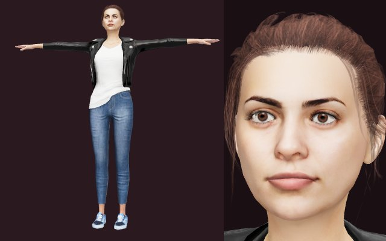
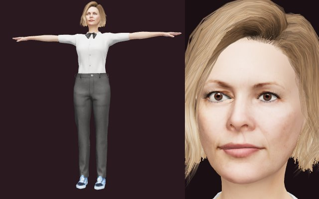
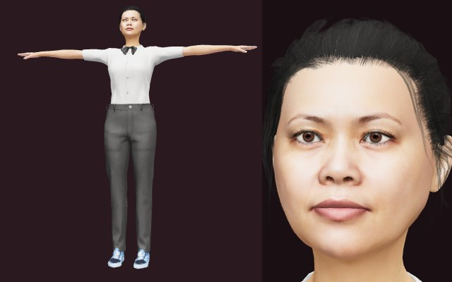
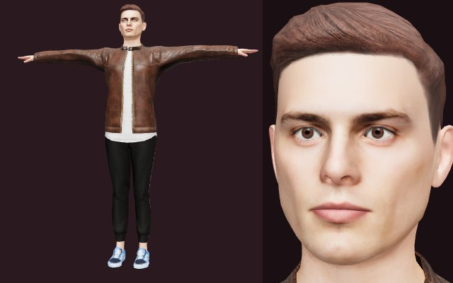
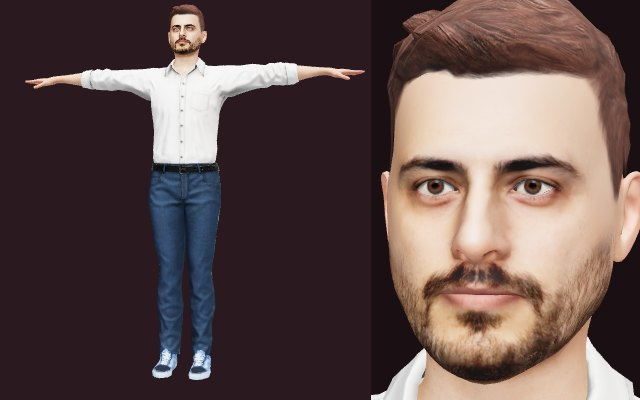
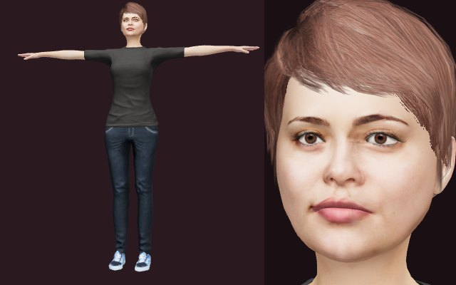
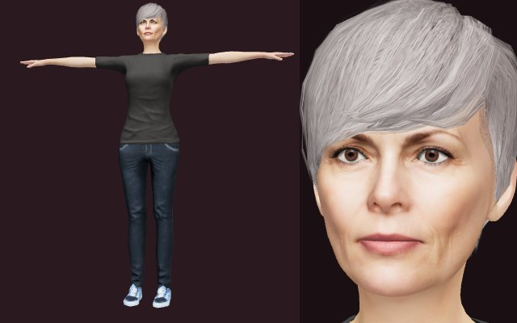

# Avatar kütüphanesi

Bir animasyonda gerçekçi bir insan karakteri gerekirse kullanılabilecek hazır modeller. Kullanmak zorunlu değil; animasyon karakter gerektirmiyorsa ya da başka bir yaklaşım daha uygunsa hiç kullanılmaz. Hepsi Avaturn ile üretildi (glTF 2.0, tek iskelet, 54 kemik: `Hips`, `Spine…`, `Neck`, `Head`, `Left/RightArm`, parmaklar, bacaklar, gözler). Aynı iskeleti paylaştıkları için bir karakter için yazılan poz, ters kinematik ve yüz ifadesi kodu diğerlerinde de çalışır.

Bu dosya `npm run avatars -- readme` ile `catalog.json`'dan üretilir; elle düzenlemeyin.

## Nasıl kullanılır

```
npm install                                          # kökte, bir kez (araçların bağımlılıkları)
npm run avatars -- list                              # kütüphanedeki karakterler
npm run avatars -- use set-01-f02 heartbeat          # → animations/biology/heartbeat/assets/avatar-set-01-f02.glb
npm run avatars -- use set-01-f02 heartbeat teacher.glb
npm run avatars -- add set-02-f03                    # ham <kimlik>.glb dosyasını küçültüp ekler (+ küçük resim)
npm run avatars -- thumbs                            # küçük resimleri yeniden çizer
```

Animasyonlar bağımsız kalsın diye model, kullanıldığı animasyonun `assets/` klasörüne **kopyalanır**; animasyon onu nasıl yükleyeceğine kendisi karar verir.

## Model içeriği

- **Yüz şekilleri (morph target):** 52 ARKit ifadesi (`jawOpen`, `eyeBlinkLeft`, `mouthSmile`, `browInnerUp`…) ve 15 konuşma şekli (`viseme_aa`, `viseme_O`, `viseme_PP`…): anlatımla dudak senkronu yapılabilir.
- **Parçalar:** Body, Head, Eye, EyeAO, Eyelash, Teeth, Tongue, saç, ayakkabı ve kıyafet.
- **Sıkıştırma:** geometri `EXT_meshopt_compression`, dokular WebP. Yükleyicide meshopt çözücüsü gerekir (three.js: `GLTFLoader.setMeshoptDecoder`, Babylon.js: `MeshoptCompression`).
- **Boyut:** ham ~14 MB → kütüphanede ~3,5 MB; ham modeldeki tek karelik bekleme animasyonu atıldı. Model T-pozunda gelir.
- **Ham modeller** git'te değil: `C:/Users/Eyüp/Desktop/cafe-avatars-glb` (başka bir yer için `AVATAR_SOURCE` ortam değişkeni).

## Karakterler (7)

| Görünüm | Kimlik | Kişi | Saç ve kıyafet |
|---|---|---|---|
|  | `set-01-f02` | Kadın, 29 | Alçak topuz, koyu kahve saç; siyah deri ceket, beyaz tişört, kot |
|  | `set-01-f03` | Kadın, 47 | Omuz hizasında kül sarısı saç; fiyonklu beyaz bluz, gri pantolon |
|  | `set-01-f10` | Kadın, 42 | Arkaya toplanmış siyah saç; fiyonklu beyaz bluz, gri pantolon |
|  | `set-01-m01` | Erkek, 24 | Kısa düz kestane saç; kahverengi deri ceket, siyah pantolon |
|  | `set-01-m02` | Erkek, 32 | Kısa dalgalı koyu saç, sakal; beyaz gömlek, kot |
|  | `set-02-f02` | Kadın, 26 | Kısa kestane saç; koyu tişört, koyu kot |
|  | `set-02-f10` | Kadın, 58 | Kısa gümüş rengi saç; koyu tişört, koyu kot |

Yeni bir avatar eklemek için ham dosyayı (`<kimlik>.glb`) kaynak klasöre koyup `npm run avatars -- add <kimlik>` çalıştırın. Ardından `catalog.json` içinde yaşı ve açıklamayı doldurup `npm run avatars -- readme` ile bu dosyayı yenileyin.
